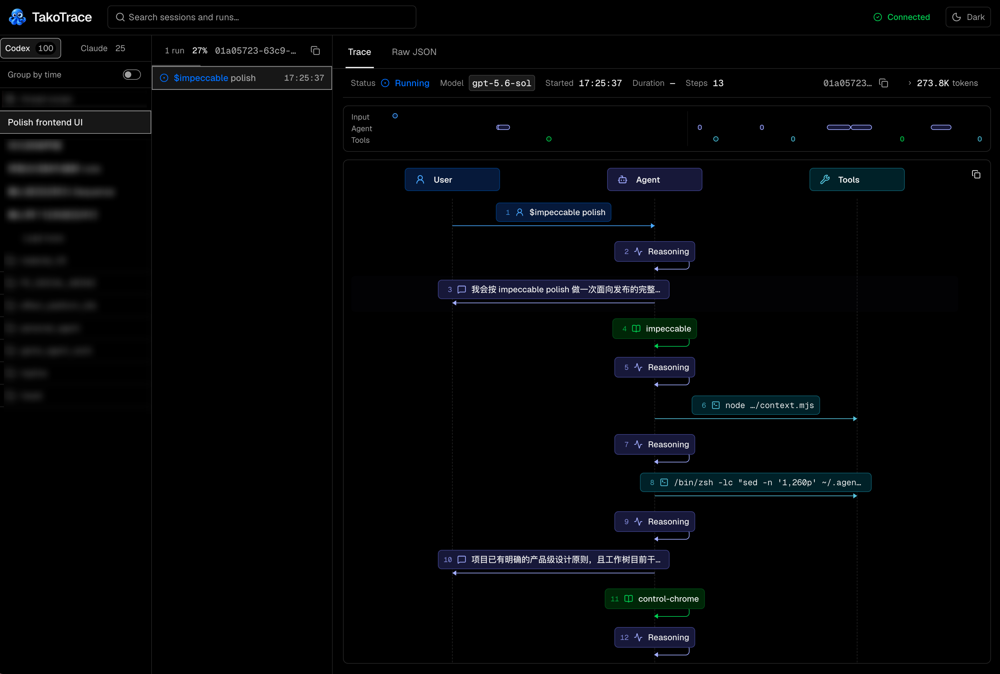

<p align="center">
  
</p>

<h1 align="center">TakoTrace</h1>

<p align="center">Inspect Codex and Claude Code sessions as timelines, sequence diagrams, and raw events.</p>

<p align="center">
  <a href="https://github.com/zhaofinger/takotrace/stargazers"></a>
  
  
  
  <a href="./LICENSE"></a>
</p>

<p align="center"><a href="./README.zh-CN.md">中文</a></p>

TakoTrace turns local AI coding sessions into a browsable execution trace. Follow the user request, agent reasoning, commands, file changes, MCP calls, skills, and subagents without digging through rollout files or terminal logs.

<p align="center">
  
</p>

## Quick start

Requires Node.js 22+ and Codex, Claude Code, or both.

```bash
npx takotrace
```

TakoTrace listens on `127.0.0.1:4317`, starts the available providers, and opens the browser.

```bash
# Start one provider
npx takotrace --provider codex
npx takotrace --provider claude

# Select a Codex binary
npx takotrace --codex-path /path/to/codex

# Change the port and keep the browser closed
npx takotrace --port 4400 --no-open
```

Run `npx takotrace --help` for every CLI option.

## What you can inspect

- Sessions grouped by provider and working directory.
- Each run as a Trace, recorded Context, or Raw JSON.
- Commands, file changes, MCP calls, skills, and subagent relationships.
- Token usage, Markdown, attachments, images, and local source files.
- Codex instructions, workspace, permissions, runtime, and compaction context captured from local rollout files.
- Claude session metadata from local history, plus permissions, tools, MCP servers, skills, plugins, and context usage for managed live runs.
- Codex history recovered read-only from local rollout files when App Server decoding fails.

TakoTrace uses **Session**, **Run**, and **Step** in the UI. Raw APIs keep the original provider field names.

## Data and security

TakoTrace binds to loopback by default, keeps runtime state in memory, and adds no telemetry or remote session storage. Codex rollout fallback and Claude history access are read-only. Provider authentication stays with Codex or Claude Code.

> [!WARNING]
> The local API has no general authentication layer. Do not expose it directly to a LAN or the public internet, including with `--host 0.0.0.0`.

## License

TakoTrace's original code is licensed under the [Apache License 2.0](./LICENSE). See [Third-Party Notices](./THIRD_PARTY_NOTICES.md) for material governed separately.
